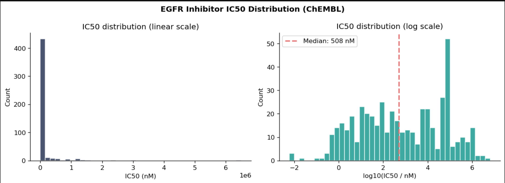

# Computational Drug Discovery Analysis

### From Molecular Structure to Biological Activity. 
---

## 📌 Project Overview

How much can we learn about a drug simply from its molecular structure?

This project explores that question by analysing **eight well-known drug molecules** using cheminformatics and molecular descriptors. Rather than looking at the molecules only as chemical structures, the analysis converts them into numerical representations that allow their structures, properties and biological activity to be compared computationally.

The project follows a simple progression:

> **Molecular Structure → Molecular Fingerprints → Structural Similarity → Physicochemical Properties → Drug-Likeness → Biological Activity**

The central finding is that **molecular structure provides valuable information about a compound, but it does not tell the complete story about biological potency**.


---

 Project Workflow

```text
                   MOLECULAR STRUCTURES
                            │
                            ▼
                  STRUCTURE STANDARDISATION
                            │
                            ▼
                  MOLECULAR FINGERPRINTS
                    ┌───────┴───────┐
                    ▼               ▼
                 Morgan           MACCS
                    │               │
                    └───────┬───────┘
                            ▼
                  STRUCTURAL SIMILARITY
                            │
                            ▼
                PHYSICOCHEMICAL PROPERTIES
                            │
                            ▼
                   LIPINSKI RULE OF FIVE
                            │
                            ▼
                    EGFR BIOLOGICAL DATA
                            │
                            ▼
                       IC50 ACTIVITY
                            │
                            ▼
                  STRUCTURE → ACTIVITY
                     RELATIONSHIP
```

The analysis therefore moves from **what a molecule looks like** to **what properties it has** and finally to **how it behaves biologically**.

---

# Molecular Fingerprints 

Chemical structures are difficult for computers to compare directly. To solve this, the molecules were converted into **molecular fingerprints** — numerical representations of structural features.

A fingerprint can be thought of as a checklist:

```text
1 = structural feature is present
0 = structural feature is absent
```

This allows molecules to be compared computationally.

## Morgan Fingerprints

The analysis used **Morgan fingerprints with 1,024 bits**.

The number of active bits varies considerably.

For example:

* **Paracetamol:** 19 active bits
* **Aspirin:** 24 active bits
* **Ciprofloxacin:** 45 active bits
* **Sildenafil:** 65 active bits
* **Imatinib:** 65 active bits

This indicates that the molecules contain very different numbers of structural features captured by the fingerprint.

> **Important:** More active fingerprint bits does not mean a drug is more effective. It reflects differences in molecular structure and complexity.

### 📊 Morgan Fingerprints


---

## The Effect of Fingerprint Radius

Morgan fingerprints can capture molecular information at different radii.

For aspirin:


As the radius increases, the fingerprint considers a larger structural neighbourhood around each atom.

This means that increasing the radius allows the representation to capture **more structural context**.

```text
Radius 0
   ↓
Local atomic information

Radius 1
   ↓
Atoms + neighbouring structure

Radius 2
   ↓
Larger molecular environments
```

---

## MACCS Fingerprints

A second molecular representation was generated using **MACCS fingerprints**.

While Morgan fingerprints identify structural patterns through molecular environments, MACCS fingerprints use a predefined set of chemical substructure keys.

Using both approaches allows us to ask:

> **Does the way we represent a molecule change the similarities we detect?**


---

# 🔗 2. Molecular Similarity

Once the molecules had been converted into fingerprints, their structural similarity could be quantified using the **Tanimoto similarity coefficient**.

A score closer to:

```text
0 → Low similarity
1 → High similarity
```

Three comparisons were particularly informative:

| Molecular Pair        | Morgan Similarity | MACCS Similarity |
| --------------------- | ----------------: | ---------------: |
| Erlotinib vs Imatinib |             0.167 |            0.485 |
| Erlotinib vs Aspirin  |             0.127 |            0.291 |
| Imatinib vs Aspirin   |             0.113 |            0.125 |

### 💡 What does this tell us?

Erlotinib and Imatinib are both kinase inhibitors, and their MACCS similarity is noticeably higher than the comparisons involving aspirin.

However, their Morgan similarity is still relatively low.

This highlights two important ideas:

### 1. Biological relationships do not necessarily mean highly similar complete structures

Two compounds can interact with related biological targets without having extremely similar overall molecular structures.

### 2. Similarity depends on the representation

Erlotinib and Imatinib have:

```text
Morgan similarity  → 0.167
MACCS similarity   → 0.485
```

The difference demonstrates that different fingerprinting methods capture different aspects of chemical structure.

> **There is therefore no single definition of molecular similarity — it depends on what structural features we choose to measure.**

---

# ⚗️ 3. Physicochemical Properties

Fingerprints tell us about **structural features**.

The next question is:

> **What chemical and physical properties result from those structures?**

The analysis calculated:

* **MW** — Molecular Weight
* **LogP** — Lipophilicity
* **HBD** — Hydrogen Bond Donors
* **HBA** — Hydrogen Bond Acceptors
* **RotB** — Rotatable Bonds
* **TPSA** — Topological Polar Surface Area
* **Rings** — Total Ring Count
* **ArRings** — Aromatic Ring Count

## 📊 Molecular Descriptors

| Drug          |     MW |  LogP | HBD | HBA | RotB |  TPSA | Rings | ArRings |
| ------------- | -----: | ----: | --: | --: | ---: | ----: | ----: | ------: |
| Aspirin       | 180.16 |  1.31 |   1 |   3 |    2 | 63.60 |     1 |       1 |
| Caffeine      | 194.19 | -1.03 |   0 |   3 |    0 | 61.82 |     2 |       2 |
| Ibuprofen     | 206.28 |  3.07 |   1 |   1 |    4 | 37.30 |     1 |       1 |
| Paracetamol   | 151.16 |  1.35 |   2 |   2 |    1 | 49.33 |     1 |       1 |
| Ciprofloxacin | 331.35 |  1.58 |   2 |   4 |    3 | 74.57 |     4 |       2 |
| Sildenafil    | 539.70 |  3.30 |   1 |   6 |   10 | 96.77 |     4 |       3 |
| Erlotinib     | 393.44 |  3.41 |   1 |   7 |   10 | 74.73 |     3 |       3 |
| Imatinib      | 493.62 |  4.59 |   2 |   7 |    7 | 86.28 |     5 |       4 |

### 📈 What stands out?

The data shows a substantial difference between the simpler and more structurally complex drugs.

For example:

### Paracetamol

```text
MW       = 151.16
Rings    = 1
RotB     = 1
HBD      = 2
HBA      = 2
```

Compared with:

### Imatinib

```text
MW       = 493.62
Rings    = 5
RotB     = 7
HBD      = 2
HBA      = 7
LogP     = 4.59
```

The molecules therefore occupy very different regions of **physicochemical space**.

This is important because molecular structure doesn't just determine how a molecule looks — it influences properties such as size, polarity, flexibility and lipophilicity.


---

# 💊 4. Lipinski's Rule of Five

The next question is:

> **Despite their structural differences, do these molecules have broadly drug-like physicochemical properties?**

To investigate this, the analysis applies **Lipinski's Rule of Five**.

| Property         | Threshold |
| ---------------- | --------: |
| Molecular Weight |     ≤ 500 |
| LogP             |       ≤ 5 |
| HBD              |       ≤ 5 |
| HBA              |      ≤ 10 |

## Results

| Drug          | Violations | Overall Result |
| ------------- | ---------: | -------------- |
| Aspirin       |          0 | ✓ Pass         |
| Caffeine      |          0 | ✓ Pass         |
| Ibuprofen     |          0 | ✓ Pass         |
| Paracetamol   |          0 | ✓ Pass         |
| Ciprofloxacin |          0 | ✓ Pass         |
| Sildenafil    |          1 | ✓ Pass         |
| Erlotinib     |          0 | ✓ Pass         |
| Imatinib      |          0 | ✓ Pass         |

### 🔎 The interesting result

Seven of the eight compounds satisfy **all four individual thresholds**.

Sildenafil is the exception because:

```text
Molecular Weight = 539.70
Lipinski threshold = 500
```

Therefore, sildenafil has **one violation**.

However, using the criterion applied in this analysis — passing with fewer than two violations — it still passes the overall Rule-of-Five classification.

### 💡 What does this tell us?

The result challenges a simple assumption:

> **"A more complex molecule must be less drug-like."**

The data shows that this isn't necessarily true.

Imatinib, for example, is substantially more complex than paracetamol, but it still satisfies the selected Lipinski criteria.

Therefore:

> **Drug-likeness is not the same as structural simplicity.**

---

# 🧪 5. EGFR Biological Activity

So far, the analysis has focused on the molecules themselves.

But there is a bigger question:

> **Do these chemical properties actually translate into biological activity?**

To investigate this, the project examines **EGFR inhibitor data from ChEMBL** using IC50 measurements.

## What is IC50?

IC50 represents the concentration of a compound required to produce **50% inhibition** of a biological target under a particular assay.

In simple terms:

```text
Lower IC50
      ↓
Stronger inhibition

Higher IC50
      ↓
Weaker inhibition
```

---

## 📊 IC50 Distribution

The EGFR dataset contains IC50 measurements spanning a very large range.

Examples include:

```text
40 nM
41 nM
170 nM
300 nM
440 nM
7,820 nM
9,300 nM
500,000 nM
```

The median IC50 is approximately:

> **508 nM**

This demonstrates that EGFR inhibitor potency can vary by several orders of magnitude.



---

## 📉 Why Use a Logarithmic Scale?

The IC50 distribution is highly skewed.

A small number of extremely large values — including an observation around **500,000 nM** — stretch the linear x-axis.

As a result, most of the observations become compressed near the lower end.

A logarithmic transformation makes the distribution much easier to interpret.


### Key lesson

> **Biological activity data often spans multiple orders of magnitude, making log-transformation useful for visualising and analysing potency.**

---

## 🔬 The Same Molecule Can Have Different IC50 Measurements

One particularly interesting observation is that **CHEMBL68920** appears with multiple reported IC50 values:

```text
41 nM
300 nM
7,820 nM
```

The molecular descriptors remain the same across these records.

This highlights an important limitation:

> **Molecular structure alone cannot explain every biological activity measurement.**

Differences in experimental conditions, assay systems, biological context and measurement variability can contribute to different observed IC50 values.

This is particularly important when developing machine-learning models for drug discovery.

---

# 🧠 6. Key Findings

## 🔹 1. Chemical structures can be converted into numerical data

Molecular fingerprints transform chemical structures into machine-readable features.

This makes it possible to perform quantitative comparisons between molecules.

---

## 🔹 2. Molecular complexity varies substantially

The eight drugs activate very different numbers of fingerprint features.

For example:

```text
Paracetamol → 19 active Morgan bits
Sildenafil   → 65 active Morgan bits
Imatinib     → 65 active Morgan bits
```

This reflects substantial structural diversity.

---

## 🔹 3. Similarity depends on how it is measured

Erlotinib and Imatinib have:

```text
Morgan → 0.167
MACCS  → 0.485
```

The difference demonstrates that molecular similarity is dependent on the representation used.

---

## 🔹 4. Structurally complex molecules can still be drug-like

Despite substantial differences in structure, all eight compounds pass the Rule-of-Five criterion used in this analysis.

Sildenafil has one violation because of its molecular weight.

---

## 🔹 5. Drug-likeness and biological potency are different concepts

A compound satisfying Lipinski's criteria does not automatically mean it will strongly inhibit a particular biological target.

Lipinski evaluates broad physicochemical characteristics.

IC50 measures biological activity against a specific target under an experimental setup.

They answer **different questions**.

---

## 🔹 6. Biological activity varies dramatically

EGFR inhibitor IC50 values span from tens of nanomolar to hundreds of thousands of nanomolar.

This means compounds targeting the same biological target can have dramatically different levels of potency.

---

## 🔹 7. Structure provides information — but not the whole story

The overall analysis leads to an important conclusion:

```text
Molecular Structure
       ↓
Structural Features
       ↓
Physicochemical Properties
       ↓
Drug-Likeness
       ↓
          ?
       ↓
Biological Activity
```

The final relationship is not perfectly predictable.

**Biological activity is influenced by more than molecular structure alone.**

---


# 🧬 Final Takeaway

This project tells a story that moves from **chemistry to data science to biology**.

We begin with molecular structures.

We convert those structures into numerical fingerprints.

We use those fingerprints to measure similarity.

We calculate physicochemical properties to understand how the molecules differ.

We test whether those properties satisfy common drug-likeness criteria.

Finally, we examine biological activity and discover that potency can vary enormously — meaning that **structure alone cannot completely explain biological behaviour**.

The overall journey is:

```text
STRUCTURE
    ↓
REPRESENTATION
    ↓
SIMILARITY
    ↓
PHYSICOCHEMICAL PROPERTIES
    ↓
DRUG-LIKENESS
    ↓
BIOLOGICAL ACTIVITY
    ↓
MACHINE LEARNING
```

> **The key lesson is that computational drug discovery is not about finding one property that makes a good drug. It is about combining multiple layers of molecular and biological information to understand — and eventually predict — how compounds behave.**

---

## 🛠️ Technologies Used

* **Python**
* **RDKit** — cheminformatics and molecular structure analysis
* **Pandas** — data manipulation
* **NumPy** — numerical computation
* **Matplotlib** — visualisation
* **Seaborn** — statistical visualisation
* **ChEMBL** — biological activity data
* **Jupyter Notebook** — analysis environment

---

## 📁 Repository Structure

```text
computational-drug-discovery/
│
├── data/
│   ├── drugs.csv
│   └── egfr_inhibitors.csv
│
├── images/
│   ├── morgan_fingerprints.png
│   ├── morgan_radius_comparison.png
│   ├── maccs_fingerprints.png
│   ├── physicochemical_descriptors.png
│   ├── egfr_ic50_distribution.png
│   └── egfr_ic50_log_distribution.png
│
├── notebooks/
│   └── computational_drug_discovery.ipynb
│
├── requirements.txt
└── README.md
```

---

## ▶️ Running the Project

### Clone the repository

```bash
git clone https://github.com/YOUR-USERNAME/computational-drug-discovery.git
cd computational-drug-discovery
```

### Install dependencies

```bash
pip install -r requirements.txt
```

### Launch Jupyter

```bash
jupyter notebook
```

Open the analysis notebook:

```text
notebooks/computational_drug_discovery.ipynb
```

---

**Latifa Al Khalifa**

Data Science & Business Analytics
